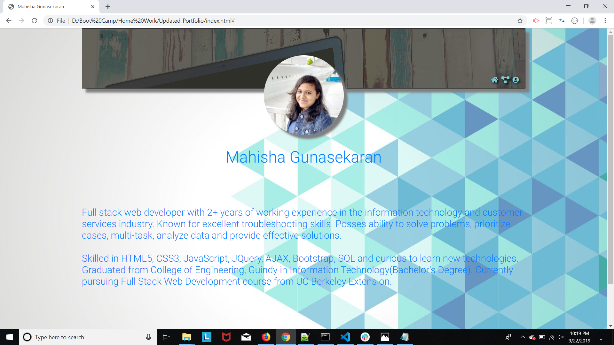
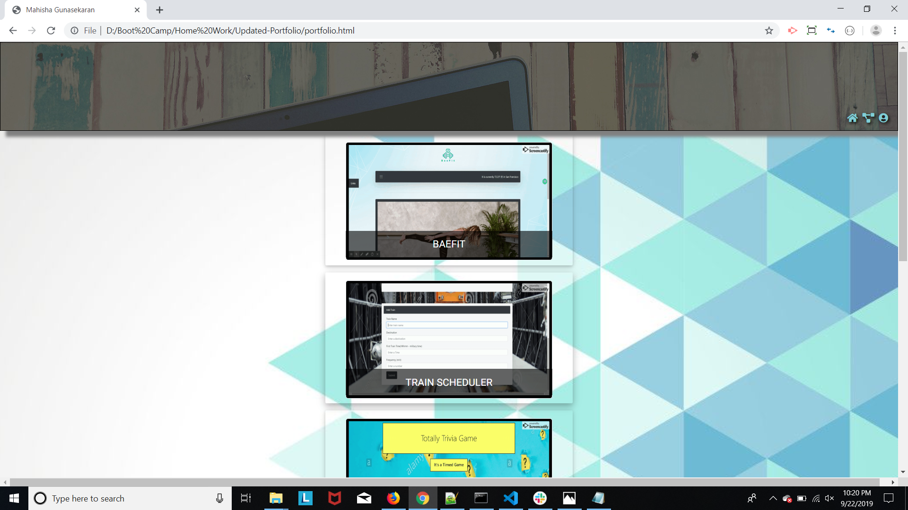
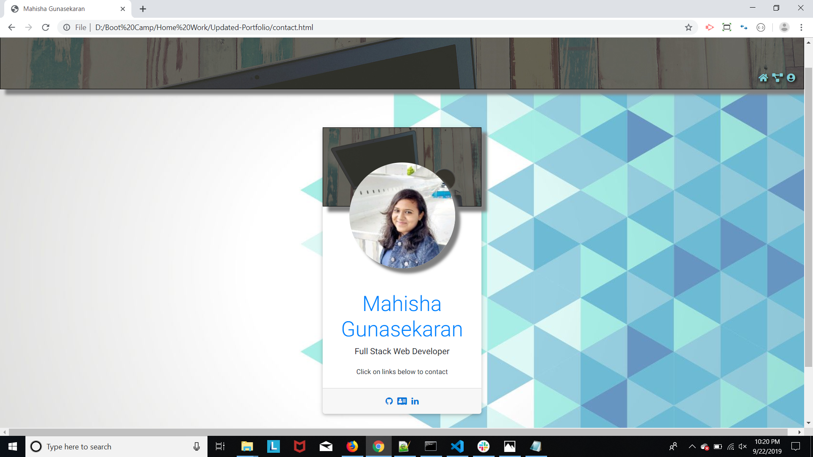

# Updated Portfolio

## Site pictures




## Technologies Used
- HTML : used to create elements on the DOM
- Bootstrap : to style html pages and to be page responsive
- Git : version control system to track changes to source code
- GitHub : hosts repository that can be deployed to GitHub pages

## Summary
### Built a professional portfolio site using HTML/Bootstrap. This website basically has three web pages linked to each other. Applied different concepts like bootstrap, padding, margins to be mobile responsive.

## Code Snippet
```HTML
<!-- The below code snippet is added to my contact card -->
<div class="social-links text-center">
    <!-- Utilised font-awesome to add my linkedin, github accounts -->
                      <a href="https://github.com/Mahi-Mani" class="github"><i class="fa fa-github fa-fw"></i></a>
                      <a class="mailto" href="mailto:m.mahishamani@gmail.com" class="gmail"><i class="fa fa-address-card fa-fw"></i></a>
                      <a href="https://www.linkedin.com/in/mahisha-gunasekaran-0a780a88" class="linkedin"><i class="fa fa-linkedin fa-fw"></i></a>
                  </div>
```


## Author Links
[LinkedIn](https://www.linkedin.com/in/mahisha-gunasekaran-0a780a88/)

[GitHub](https://github.com/Mahi-Mani)

